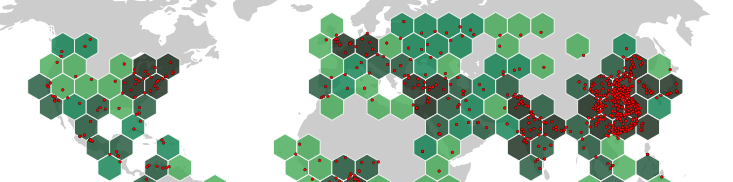

`geogrid` is a JavaScript library that allows you to create regular grids with various patterns on a flat plane or on the globe. In addition, it provides geoprocessing functions to transfer GeoJSON data (points, lines, or polygons) onto these grids.

- Documentation: [https://neocarto.github.io/geogrid/](https://neocarto.github.io/geogrid/)
- Live examples: [https://observablehq.com/@neocartocnrs/hello-geogrid](https://observablehq.com/@neocartocnrs/hello-geogrid)
